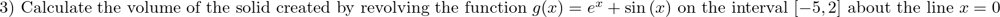

# Math 20B Supplemental Instruction Week 2

Welcome to Week 2 of Math 20B SI sessions! Today we'll be covering solids of revolution.

This webpage will always be available to you, so if you come in late or have to leave early, or we don't get through all the practice problems, you can access them 

You can submit anonymous questions to me any time during the SI session using the link [here](https://forms.gle/DP6pPRdmFoGrqPk88). Or, feel free to unmute yourself and ask questions or type them in the chat at any time!

## Mini-Review: Integration

## Mini-Review: Solids of Revolution
A solid of revolution is any 3-dimensional solid created by revolving a 2-dimensional plane figure about a line in the plane. Let's visualize one, specifically $f(x)=x^2$!

[Here](https://www.geogebra.org/classic/v5c6n7rs) is a link to the visual. You can drag the slider of the angle and pan the camera to visualize the full graph.

We're interested in finding the volume of a solid of revolution. The general formula for this volume is listed below.  
$V = \int_a^b\pi\left[f(x)\right]^2\mathrm{d}x$
f(x) is 
<details>
  <summary>Click me</summary>
  
  ### Heading
  1. Foo
  2. Bar
     * Baz
     * Qux

  ### Some Javascript
  ```js
  function logSomething(something) {
    console.log('Something', something);
  }
  ```
</details>

## Example

Let's visualize the solid created first.

## Problem 1

Work through
## Problem 2


## Problem 3

