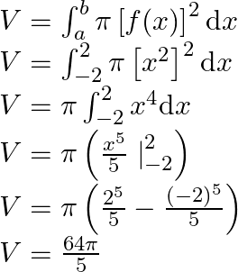

# Math 20B Supplemental Instruction Week 2

Welcome to Week 2 of Math 20B SI sessions! Today we'll be covering solids of revolution.

## Background
<details>
  <summary>Click me</summary>
  
  ### Heading
  1. Foo
  2. Bar
     * Baz
     * Qux

  ### Some Javascript
  ```js
  function logSomething(something) {
    console.log('Something', something);
  }
  ```
</details>

## Example

## Problem 1

## Problem 2

## Problem 3
